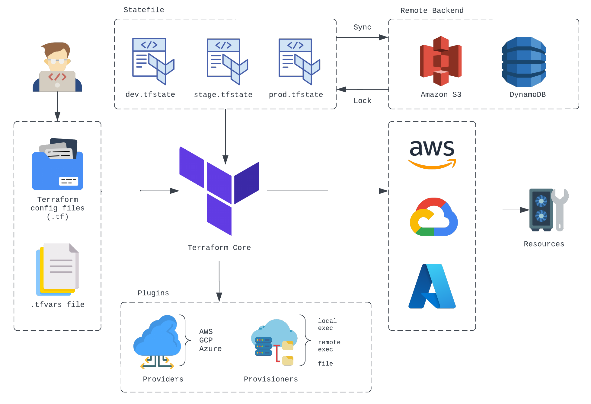
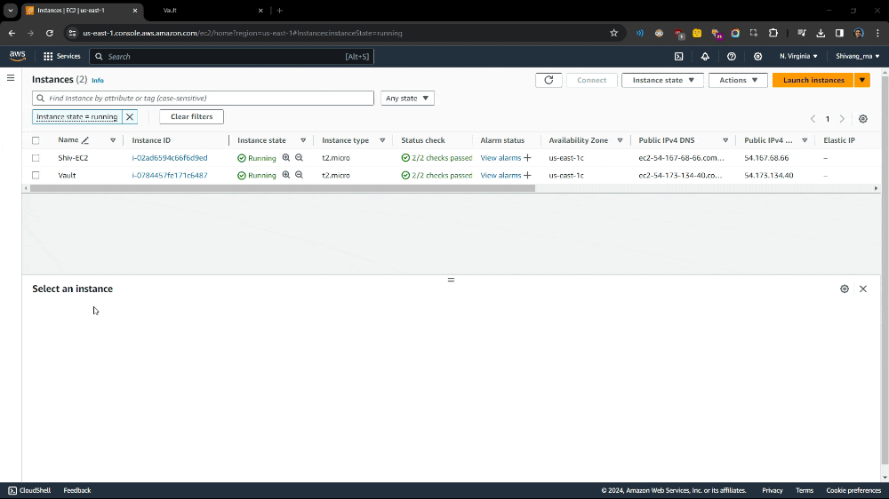

# 🗺 Terraform Learning Journey

Welcome to my Terraform Learning Journey repository!🤓 This repository documents my progress through a structured learning path covering various aspects of Terraform, from basic setup to advanced topics.
## Terraform
Terraform is an open-source Infrastructure as Code (IaC) tool developed by HashiCorp. It enables users to define and provision infrastructure resources in a declarative manner, allowing for automation, consistency, and scalability in managing infrastructure across various cloud providers and on-premises environments.

    

## 🚀 Getting Started with Terraform

**Introduction to Terraform and IaC**

Understanding the fundamentals of Terraform and Infrastructure as Code. I learned how Terraform allows us to define and provision infrastructure using declarative configuration files.

**Setting up Terraform for AWS**

Configuring Terraform to work with AWS services. I learned how to set up AWS credentials and configure the AWS provider within Terraform to start provisioning resources.

**Writing basic Terraform Code**

Writing basic Terraform configurations to provision resources. I started with a simple example to understand the basic structure of a Terraform configuration file and how to define resources using the HashiCorp Configuration Language (HCL).

**Terraform Lifecycle**

Learning about the key commands `init`, `plan`, and `apply`. These commands are essential for initializing a Terraform project, generating an execution plan, and applying the changes to provision or update infrastructure.

**Launching an EC2 Instance**

Provisioning an EC2 instance on AWS using Terraform. I explored different attributes like instance type, AMI, and tags to customize the instance.

**Terraform State Basics**

Understanding Terraform state files and their management. I learned about desired and current states, and how Terraform manages these states to ensure infrastructure consistency.

## 🐡 Advanced Terraform Configuration
**Understanding Providers and Resources**

Exploring the role of providers and resources in Terraform configurations. Providers are responsible for managing the lifecycle of resources, and resources define the infrastructure components to be provisioned.

**Variables and Outputs in Terraform**

Utilizing variables and outputs for dynamic configurations. Variables allow us to parameterize configurations, while outputs enable us to retrieve and display essential information after resource creation.

**Conditional Expressions and Functions**

Adding logic and functions to Terraform code. I learned about conditional expressions for implementing logic and various built-in functions for tasks like string manipulation and calculations.

**Debugging and Formatting Terraform Files**

Mastering debugging techniques and code formatting. Proper formatting using `terraform fmt` ensures consistency and readability, while debugging helps identify and resolve issues in configurations.

## 📁 Building Reusable Infrastructure with Modules

**Creating Modular Infrastructure with Terraform Modules**

Implementing reusable infrastructure components. Modules enable us to encapsulate and share configuration logic, promoting code reuse and maintainability.

**Local Values and Data Sources**

Simplifying configurations with local values and data sources. Local values help in simplifying complex expressions, while data sources allow fetching data from existing resources or external systems.

**Using Variables and Inputs with Modules**

Customizing module behavior with variables and inputs. I explored how to pass variables to modules and use inputs to customize module behavior based on specific requirements.

**Leveraging Outputs from Modules**

Accessing critical information from module outputs. Module outputs allow us to propagate data from modules to the root configuration or retrieve essential information for further processing.

**Exploring Terraform Registry for Modules**

Integrating pre-built modules from the Terraform Registry. The Terraform Registry hosts a collection of community-contributed modules, making it easy to incorporate reusable infrastructure components into configurations.

## 🕷 Terraform State Management

**Introduction to Terraform Backends**

Understanding Terraform backends for remote state storage. Terraform backends store the state file remotely, facilitating collaboration and providing resilience against data loss.

**Implementing S3 Backend for State Storage**

Configuring S3 as a backend for remote state storage. I gained hands-on experience setting up an S3 bucket as a backend, enhancing collaboration and state management.

**State Locking with DynamoDB**

Ensuring state consistency with DynamoDB for state locking. DynamoDB provides a locking mechanism to prevent concurrent updates to the Terraform state, maintaining infrastructure integrity.

## 🐛 Provisioning and Provisioners

**Understanding Provisioners in Terraform**

Learning about provisioners for executing actions on resources. Provisioners allow executing commands or scripts on remote resources during resource creation or destruction.

**Remote-exec and Local-exec Provisioners**

Differentiating between remote-exec and local-exec provisioners. Remote-exec provisions actions on remote servers, while local-exec performs tasks locally on the Terraform host.

**Applying Provisioners at Creation and Destruction**

Configuring provisioners for specific actions during resource lifecycle. I learned how to apply provisioners at different stages, such as creation or destruction of resources, to execute necessary tasks.

**Failure Handling for Provisioners**

Implementing failure handling mechanisms for provisioners. It's essential to handle provisioner failures gracefully using retry mechanisms, timeouts, and error-handling strategies.

## 🐞 Managing Environments with Workspaces

**Introduction to Terraform Workspaces**

Understanding workspaces for managing different environments. Workspaces allow isolating configurations and state files, enabling environment-specific configurations.

**Creating and Switching Between Workspaces**

Practicing workspace creation and switching commands. I learned how to create and switch between new workspaces using `terraform workspace` commands.

**Using Workspaces for Environment Management**

Leveraging workspaces for maintaining separate state files for environments. Workspaces streamline environment management by isolating state files and configurations, making it easier to manage multiple environments.

## 🐜 Security and Advanced Topics

**HashiCorp Vault Overview**

Understanding the significance of HashiCorp Vault for secret management. Vault provides a centralized solution for storing and managing sensitive data, ensuring security and compliance.

**Integrating Terraform with Vault for Secrets**

Implementing Vault integration for managing sensitive data securely. I learned how to integrate Terraform with Vault to retrieve and use secrets within configurations, enhancing security and compliance measures.

## 👨‍💻 Conclusion

This repository serves as a documentation of my detailed learning journey with Terraform.
One of the most significant insights I've gained is the importance of abstraction and modularity in infrastructure management. Terraform's modular approach through modules and workspaces has enabled me to create reusable and scalable infrastructure components, streamlining the provisioning process and promoting code maintainability. I've learned how to facilitate effective secret management and ensure consistency across infrastructure deployments.

Happy Terraforming! 👾

## 👋 Connect with Me
Let's connect and continue the conversation! Feel free to reach out to me via my socials below to share your thoughts, insights, and experiences with IaC tools or Terraform. I look forward to connecting with fellow IaC or Terraform enthusiasts and DevOps enthusiasts for ideas on future project! 

 

